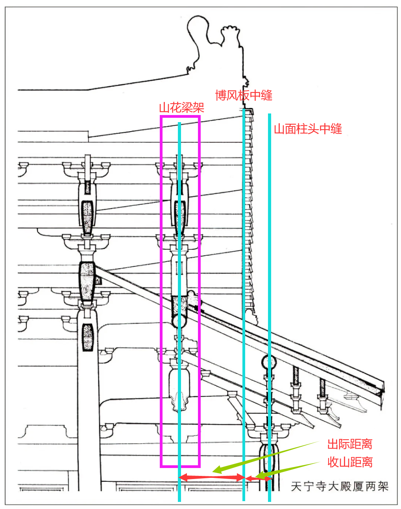

# 山与角—关于歇山建筑转角的设计

> 作者：Jacky_Blackson

## 前言

对于任何建筑来说，但凡涉及到角落，总是最难以设计的。角落不光是建筑物轮廓的尽头，也是仅次于建筑中央的视觉交点，同时还是建筑物长和宽两面结构的交点所在。这里总是需要解决结构合理性和各向视觉一致性的问题。因而各个建筑体系在这里都有诸多非常细碎的设计习惯和规矩讲究。

如果局限到中国的古建筑，且不考虑隋唐之前横纵架不对位的木架结构的话，关于转角的难点便集中到了两种带有四面坡的建筑上——庑殿顶和歇山顶。由于庑殿顶两个坡面交会的地方在整个屋面上都是相似的，因而最难以琢磨的角部设计便集中到了歇山顶上面。歇山顶转角带来的复杂屋面，正是歇山顶独特美感的来源，但也是结构上最难设计，也是结构上多样性最大的位置。考诸现存的格式建筑遗构，转角的结构不一而同，因而给我们学习或者自己独立设计这里的结构带来了巨大的挑战。

基于上述原因，本文将尝试用一种理性的方法去统括满天星斗般的歇山山面和转角设计，并用从大到小的方法逐层展开，以便读者能深入理解这里结构的设计逻辑，并能根据实际情况自己选择合理的方法进行独立的设计。

## 关于我国古建筑设计的一些特性

在开始我们的逐层剖析之前，我们需要先了解一些关于我国古建筑设计的特点，一遍能够比较自然的理解之后叙述的逻辑。

要知道，“设计一座古建筑”和“建造一座古建筑”所应当采用的思考逻辑是截然不同的。在建造的时候，我们必须从下到上逐层安装，才能保证上方的结构不会因为重力塌陷；然而在设计的时候，我们往往将中间的梁架等等对于设计不重要的结构置于设计的最后，而优先考虑影响建筑外形和空间使用的因素，诸如柱网、斗拱造型、屋面曲线、歇山收山/出际大小等等。

也就是说，我们应当把古建筑中的尺寸分解成两种来看待：一种是基于建筑物受力结构而提出来的，保证建筑物稳定安全的尺寸——姑且称之为“构造尺寸”；而另一种是为了保证古建筑造型美观、空间舒适、比例均匀等等审美使用问题而提出来的尺寸要求——姑且称之为“设计尺寸”。构造尺寸和设计尺寸是一座建筑物的两面，他们合起来保证了建筑物结构的稳定和面貌的匀称，两者缺一不可。

回到歇山转角的问题上，通过分析不难得出，所涉及的尺寸问题回归到这两类分类上来说，包括：

* 构造尺寸
  * 各个槫的高度
  * 山花梁架的支撑问题
  * 槫转角的支撑方案
  * ……
* 设计尺寸
  * 山面的收山/出际距离
  * 山花梁架的位置，=山花的大小
  * ……

因而，我们在处理歇山山面设计的时候，应该现根据建筑的设计要求和审美要求来确定好所有的设计尺寸，然后再进入关乎构造尺寸的结构设计阶段。由于歇山顶的收山距离应当根据地盘的长宽比和追求的立面效果而灵活调整，而随之的结构设计也因而各异，所以在本文中，如无特殊声明，所有讨论都基于以下假设：**博风板的水平投影距离在牛脊槫（正心檩）到下平槫（下金檩）之间**。这是一个较为普遍的收山/出际尺寸。

由于历朝历代关于歇山山花转角处的描述总是不那么完善，因此本文采用了一些术语，依次定义如下：

* 收山距离：山面柱头中缝平面到博风板中缝平面的距离
* 山花梁架（山架）：山面最靠外的一榀梁架，也即从外面看到位于山花里的那一榀梁架
* 出际距离：山花梁架中缝到博风板中缝的水平距离
* 椽架：两根檩中间的水平距离，明清时期一般称为步架

## 了解歇山顶山面的构成

歇山顶山面是一个复杂的组合体，其不能简单地看作一个单一的结构，而是应当从逻辑的依赖关系来分割成